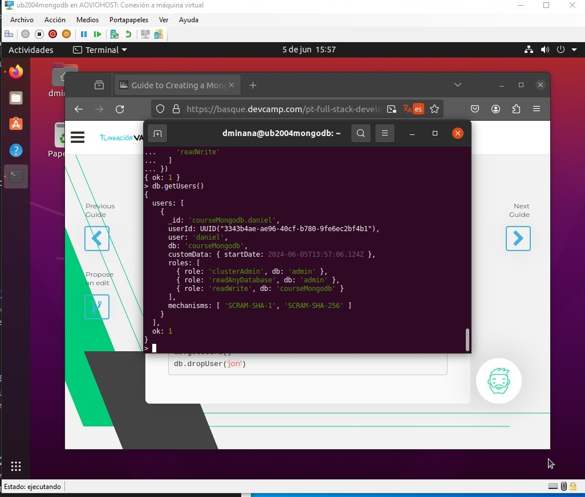
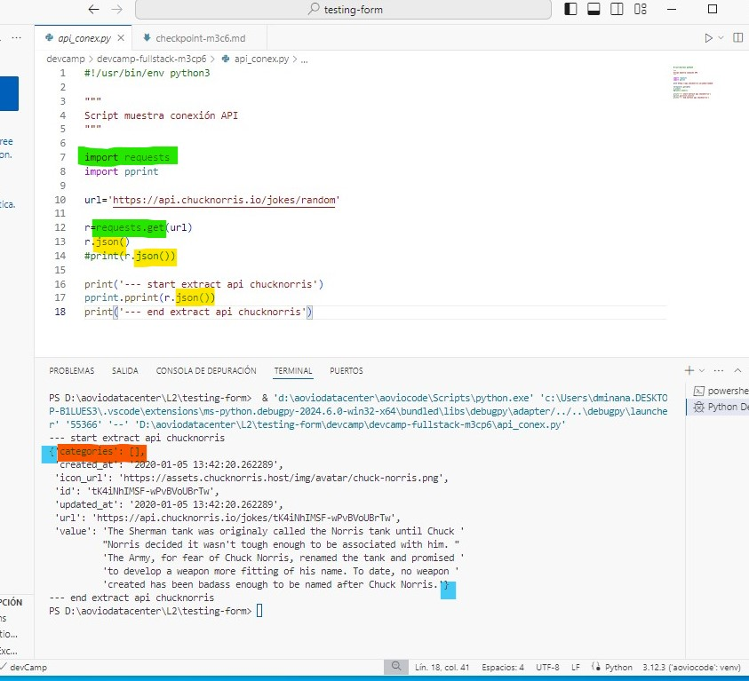
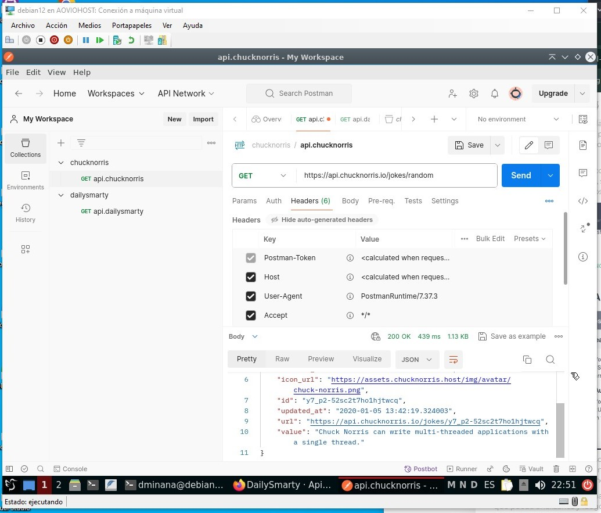

<a id="menu"></a>
# MENU

- [¿Para qué usamos Clases en Python?](#paraque)
- [¿Qué método se ejecuta automáticamente cuando se crea una instancia de una clase?](#metodo)
- [¿Cuáles son los tres verbos de API?](#verapi)
- [¿Es MongoDB una base de datos SQL o NoSQL?](#mongo)
- [¿Qué es una API?](#qesapi)
- [¿Qué es Postman?](#postman)
- [¿Qué es el polimorfismo?](#polimor)
- [¿Qué es un método dunder?](#dunder)
- [¿Qué es un decorador de python?](#decor)

___

Buenos días Daniel, felicidades por haber llegado al CheckPoint 6, te comento lo que vas a realizar...

Este checkpoint vamos a seguir con la dinámica del checkpoint anterior, necesito que realices una documentación sobre lo conceptos que te proporcionare, recuerda debes ser lo más claro y comprensible posible, estas creando un material que lo visualizarán personas que recién inician en el mundo del desarrollo por lo tanto debes también sustentarlo con ejemplos, porque se utiliza, para que se utiliza, sintaxis, etc…

Los conceptos son los siguientes:

**- ¿PARA QUÉ USAMOS CLASES EN PYTHON?**

**- ¿QUÉ MÉTODO SE EJECUTA AUTOMÁTICAMENTE CUANDO SE CREA UNA INSTANCIA DE UNA CLASE?**

**- ¿CUÁLES SON LOS TRES VERBOS DE API?**

**- ¿ES MONGODB UNA BASE DE DATOS SQL O NOSQL?**

**- ¿QUÉ ES UNA API?**

**- ¿QUÉ ES POSTMAN?**

**- ¿QUÉ ES EL POLIMORFISMO?**

**- ¿QUÉ ES UN MÉTODO DUNDER?**

**- ¿QUÉ ES UN DECORADOR DE PYTHON?**

Y POR ULTIMO NECESITO QUE ME HAGAS ESTE EJERCICIO PRÁCTICO DE PYTHON, Y LO SUBAS A GIT-HUB O REPLIT PARA REVISARLO

**-CREE UNA CLASE DE PYTHON LLAMADA USUARIO QUE USE EL MÉTODO INIT Y CREE UN NOMBRE DE USUARIO Y UNA CONTRASEÑA. CREA UN OBJETO USANDO LA CLASE.**

Esta es toda la asignación, ¡mucha suerte!

# <a id="paraque"> ¿Para qué usamos Clases en Python?</a>
[up](#menu)

Al realizar una primera búsqueda en Chrome como: **"¿qué son las clases en Python?"**. La primera respuesta que me encuentro es: **"Las clases en Python son estructuras de programación orientada a objetos"**.

Bien, pues como siempre, realizamos un análisis de la pregunta, ese sería mi primer paso para saber para qué usamos las clases en Python, para lo cual tendremos que saber qué son las clases.

Entonces, si recordamos, ¿qué son estructuras? Y nos respondemos en alto: las estructuras nos muestran cómo organizar y la sintaxis necesaria para escribir nuestro código.

Y por supuesto, aprendemos que **la programación orientada a objetos es un paradigma de programación**, que se basa en la idea de que los programas se pueden organizar como una colección de objetos interconectados, cada uno con su propio conjunto de datos y funcionalidades.

Este paradigma de programación nos ofrece poder simplificar la creación de un programa, separando sus diferentes componentes, mejora la depuración de dicho programa y la escalabilidad posterior.

Otras de las características de la POO, programación orientada a objetos, es que nos permite reducir los errores y promociona la reutilización del código.

Hay conceptos con los que vamos a tener que lidiar, ya que son usados en la POO, tales como:

- Abstracción de datos.
- Encapsulación
- Eventos
- Modularidad
- Herencia.
- Polimorfismo

Podríamos decir que la programación orientada a objetos se aproxima más a las situaciones de la vida real, un ejemplo rápido podría ser:

- Visionemos una cocina estándar, muebles, electrodomésticos, cajones. Cada objeto de la cocina contiene una clase de artículos, y una cantidad diferente por artículo. Están colocados teóricamente por su uso o consumo. Entonces.

Nos piden que creemos un programa que contabilice todo el inventario y stock de dicha cocina. Estamos de acuerdo y nos ponemos manos a la obra.

En nuestra programación orientada a objetos, construimos **estructuras** que nos permiten construir objetos para poder obtener todos los beneficios del método de **programación orientada a objetos** que estamos utilizando.

Existen varios beneficios de utilizar este paradigma de programación y uno de ellos es mantener por separado los datos, de la funcionalidad dentro del propio objeto.

- Consideremos el ejemplo de nuevo con lo leído hasta ahora, programa, cocina, creamos objetos independientes pero conectados. Cada mueble podría ser una clase, clase mueble alto. Dentro de la clase mueble alto, podría haber un contador por cada tipo de plato. La funcionalidad de contar es independiente de la cantidad total de platos que tengamos y su tipo. Eso vendrá marcado por la instancia que creemos.

La respuesta que daría a esta pregunta es evidente utilizamos las clases para crear objetos de nuetro programa que nos permitan separar los datos y la funcionalidad independiente, previniendo errores de programación, permitiendonos mejorar nuestra depuración y ofreciendonos un futuro más controlado.

Pasemos a un ejemplo con código, y terminemos de entender y comprender que són, para que són, y que utilidad nos ofrecen las clases. Como siempre comenzemos con la sintaxis.


```python
"""Ejemplo básico veamos como gestiona una clase estas dos vertientes datos y funcionamiento"""

# Creamos la primera clase Basico, solo tiene que imprimir un mensaje.
class Basico:
    print('My first class')

# Creamos la instancia, llamamos a la clase Basico y lo pasamos a la variable msg
msg = Basico()

print('...')

# Queda claro que lo que se ha guardado en la variable msg es un objeto
# de la clase Basico, y que en la dirección de memoria que se muestra estan
# ubicado los datos guardados
print(msg)
```

    My first class
    ...
    <__main__.Basico object at 0x0000023AB9059BB0>
    

**La sintaxis de una clase**

- Tal como mostramos en el ejemplo, comenzamos con la palabra reservada class, seguidamente le damos un nombre a la clase iniciando el nombre con mayúscula y acabamos la expresión con dos puntos.
  - palabra-reservada    nombre-comienza-mayúscula   dos-puntos:
- Hemos creado la primera expresión para crear una clase y tras los dos puntos, tenemos nuestro bloque de código, y, por tanto, debemos aplicar espacio a la siguiente línea.
- Y a partir de aquí y teniendo claro que estamos dentro de la estructura class, podemos desarrollar nuestras funciones, nuestros bucles, nuestras variables, etc.

**¿Cómo llamamos a nuestra clase?**

- Tal cual llamamos a nuestras funciones desde cualquier parte de la aplicación y veíamos que según los parámetros que pasábamos nuestras funciones venían y ejecutaban su propósito, la forma de llamar a una clase se la denomina **creación de instancias**.
- La creación de instancias es el proceso de creación de un objeto de la clase que acabamos de escribir, es la forma que le damos vida a nuestra clase, creando objetos de ella misma con datos y funcionalidad independientes.


```python
class Invoice:
    
    def greeting(self):
        return 'Hi there'

#Creación de instancia
inv_one = Invoice()

print(inv_one)
```

    <__main__.Invoice object at 0x0000023ABA2DFEF0>
    

Si vemos lo que nos devuelve, __main__, esta expresión es un método especial llamado main, esto es solo el puntero al objeto creado. Sí, ya tenemos nuestro objeto y esta función main nos detalla la dirección de memoria donde se ha ubicado.

Esta expresión con doble guion bajo al principio y al final se nombra como Dunder main que es la abreviatura de guion bajo doble.


```python
class Invoice:
    
    def greeting(self):
        return 'Hi there'

#Creación de instancia
inv_one = Invoice()
inv_two = Invoice()
print(inv_one)
print(inv_two)

#print(inv_one.greeting())
```

    <__main__.Invoice object at 0x0000023ABA29B2F0>
    <__main__.Invoice object at 0x0000023AB8B2C380>
    

Ahora si nos fijamos, tenemos dos instancias, y el Dunder main nos muestra las dos ubicaciones en memoria distintas, si tomamos una foto de la situación y teniendo presente el funcionamiento de una función le estamos pasando un parámetro desconocido, "self", este parámetro es obligatorio pasarlo como primer argumento, este argumento es la referencia a la instancia llamada.

# <a id="metodo">¿Qué método se ejecuta automáticamente cuando se crea una instancia de una clase?</a>

[up](#menu)

Comencemos recordando que una instancia de una clase es la forma de llamar a la clase, igual que llamamos a una función llamamos a una clase y disponemos de ella a lo largo de todo nuestro código, entonces cuando llamamos, o creamos una instancia de clase, automáticamente Python ejecuta un método o función.

Ese método que se ejecuta automáticamente es el método constructor o la función especial __init__ o Dunder init. Este método lo provee el propio lenguaje Python, a continuación nos extenderemos mucho más, pero para esta pregunta con tener muy claro que los métodos dunder son métodos del propio lenguaje y que están disponibles para las clases es suficiente.

El funcionamiento es sencillo tal como apretar el botón del ascensor, en cuanto creamos una instancia dunder init, se ejecuta. Vamos a ver un ejemplo que nos mapea todo lo que hemos leído hasta el momento.

Hemos hablado de clases como estructuras que nos permiten mantener datos y funcionamiento juntos, los datos los tenemos que almacenar en memoria y el funcionamiento lo establecemos a través de las funciones que creamos dentro de la clase, en una programación orientada a objetos las clases nos proveen de esta herramienta. Python es bastante único en la forma de interactuar con las clases y donde nos permite trabajar con ellas.


```python
"""Clase básica con dunder __init__"""

class Basic:
    def __init__(self):
        def greeting(self):
            return 'My first class'

msg = Basic()
print(msg)
```

    <__main__.Basic object at 0x0000023ABA2FCCB0>
    

Revisemos lo escrito, hemos creado una clase Basic, la primera letra en mayúscula, hemos creado nuestra función constructora con dunder init, y hemos creado una función de saludo para comprobar la aplicación de funcionamiento. Aunque esta clase evidentemente está mal escrita, su objetivo se ve claro lanzar el mensaje "Mi primera clase". Lo que quería mostraros es como actúa nuestra estimada dunder init. En cuanto creamos nuestra instancia de clase Basic línea 8, init se ha ejecutado automáticamente.


```python
"""Clase básica con dunder __init__, completo"""

class Basic:
    def __init__(self, user):
        self.user = user
    
    def greeting(self):
        return f"My first class by {self.user}"

msg = Basic('Daniel')
print(msg)
print(msg.greeting())
```

    <__main__.Basic object at 0x0000023ABA2FDBE0>
    My first class by Daniel
    

Ahora, mostrando la clase bien escrita, vemos que creamos la clase, creamos la función constructora, que le pasamos dos parámetros, el obligatorio para que se llame a sí misma y el que queremos guardar que nos traerá la instancia expresada en la línea 10. Hasta el momento lo que hemos venido viendo es que una vez la instancia se cree, el dato "Daniel" lo recoge la dunder __init__, que se ha ejecutado automáticamente y lo guardamos en la variable "self.user". Después de tener el dato guardado, le aplicamos su comportamiento, en este caso a través de la función "greeting", lo que queremos es que aparezca en el retorno de esa función, tal cual vemos en la respuesta. Por una parte, vemos el objeto de la clase Basic creado en la dirección 0x000… y justo después vemos el comportamiento que le hemos solicitado, lanzando y acoplándose al retorno.

# <a id="verapi">¿Cuáles son los tres verbos de API?</a>

[up](#menu)

Lo primero posicionémonos, sabemos que es una API como recordatorio, una API es una forma de comunicarse entre dos software distintos, y entendemos como forma un lenguaje, definiciones, órdenes, protocolo. Algo establecido para que la comunicación se establezca y se puedan transferir datos entre ambas aplicaciones.

Ahora, **¿qué son los verbos de API?**, los verbos de API, son los métodos de solicitud HTTP, veremos en las siguientes preguntas que para conectar dos aplicaciones distintas(API) necesitamos realizar solicitudes y que estas solicitudes las podemos gestionar con el módulo requests que PyPi nos ofrece. Estas solicitudes pueden ser de distinto tipo, y es por eso que existen los verbos de API, aunque no siempre son verbos, en definitiva es la orden que das para trabajar con los datos, o recursos.

Y si recapitulamos un poquito, dentro del lenguaje o forma de comunicación que establece la API, existen las órdenes, las peticiones específicas de que queremos hacer con el elemento o elementos que solicitamos. Estas peticiones pueden ser de muy distintos tipos, pero cuando nos preguntan por 3, debemos de pensar en las fundamentales, las que más uso tienen, en definitiva, debemos de pensar las solicitudes que más vamos a realizar dentro de la conexión, en este caso serían GET, POST y DELETE. Existen bastantes más, aunque todas las referencias que he encontrado me devuelve las cinco más utilizadas, añadiendo PUT y PATCH.

GET -> Recupera un recurso existente
POST -> Crea un recurso nuevo
DELETE -> Elimina un recurso
PUT -> Actualiza un recurso existente
PATCH -> Actualizar parcialmente un recurso existente

Recordemos que cuando hablamos de recursos, hablamos de datos, imaginemos que estamos conectando dos aplicaciones distintas, una aplicación gestiona las plazas de parking de una empresa, y otra aplicación gestiona los empleados autorizados a utilizar el parking.

Obligatoriamente, se deben comunicar y establecer una misma forma de comunicarse para poder entenderse.

Entonces creamos una API que regulara toda esa comunicación y nos permitirá, lo primero, saber si el empleado que quiere acceder al parking está autorizado, si no amablemente le podemos pedir que desista de su intención. Tendremos posibilidad de saber el número de plazas que disponemos vacías, y mucha más información o datos, o elementos que disponemos en esa comunicación.

API, me suena a colaborar, la colaboración siempre es buena, aumenta nuestros recursos, por lo tanto, nuestras posibilidades.

```text
"""Ejemplo del parking"""

import requests
import SECURITY-PARKING
import AUTH-USER

""" Utilizamos GET recuperamos un recurso o dato existente
# SECURITY-PARKING ha detectado que user 1506 desea acceder
# Solicita que recupere el resurso y le confirme autorización

REQ-ACCESS=REQUEST.GET(AUTH-USER)

# la aplicacion AUTH-USER, recupera y devuelve su autorización
# la aplicacion SECURITY-PARKING actuaria en consecuencia 
# se creo la comunicacion, se transfirieron datos y se ejecutaron
# las instrucciones en cada aplicacion por separado
"""

""" Utilizamos POST creamos un recurso o dato
# SECURITY-PARKING ha detectado que user 1506 desea acceder
# Solicita que recupere el resurso y le confirme autorización

REQ-ACCESS=REQUEST.GET(AUTH-USER)
IF AUTORITHED
REG-ACCESS=REQUEST.POST(USER-ON)

# la aplicacion AUTH-USER, recupera y devuelve su autorización
# la aplicacion SECURITY-PARKING actuaria en consecuencia
# si esta autorizado solicitaria crear un nuevo elemento
# en usuarios activo, teniendo calculado el aforo del parking
# se creo la comunicacion, se transfirieron datos y se ejecutaron
# las instrucciones en cada aplicacion por separado
"""

""" Utilizamos DELETE eliminamos un recurso o dato existente
# SECURITY-PARKING ha detectado que user 1506 desea salir
# Solicita que se elimine el recurso del aforo

REQ-ACCESS=REQUEST.DELETE(USER-ON)

# la aplicacion AUTH-USER, recupera y elmina el recurso
# en usuarios activo, tenemos actualizado y calculado el aforo del parking
# se creo la comunicacion, se transfirieron datos y se ejecutaron
# las instrucciones en cada aplicacion por separado
"""
```


# <a id="mongo">¿Es MongoDB una base de datos SQL o NoSQL?</a>

[up](#menu)

Os puedo asegurar que cuando me llego la pregunta, me gusto, me entro una sensación, de ahí está la puerta, manejar una base de datos del tipo que sea es como manejar el vehículo más grade que anda por la carretera. Me genero un poco de ansiedad de por fin verlo operar. Pero, claro todo tiene un, pero, iluso de mí, pensaba lo instalo y a funcionar, no, no fue así. He decidido contar mi experiencia al detalle por si alguno le puede servir.

En concreto, cuando llegue a esta pregunta, lo primero que pienso, voy a montar una máquina virtual para trabajar con exclusividad, probar, romper, jejejej, disfrutar.

> Monte en mi windows10pro, un virtualbox7, estoy con windows10pro por necesidades de hardware, mi predilección es Debian, en este caso consulte la forma de montar MongoDB con Debian12 que es el ultimo que estaba disfrutando en mi antigua maquina Debian 12 con un i3 y 4gb, que dijo que demasiado para el, despues de varias pruebas, cambie de equipo por necesidades tube que montar w10pro y entonces...

Y después de ir errando y errando entre sistemas y versiones (benditos errores, me ha permitido profundizar mucho en mongodb), he conseguido montar una máquina virtual con un mongoDB operativo lo cual me ha permitido ejecutar algunos ejemplos y traeros una foto de mi primer usuario. Se que no he respondido a la pregunta todavía, pero quería poneros en situación, os presento la imagen y seguimos discutiendo sobre este tema.



Bendecido problema, he profundizado en MongoDB un montón, mongodb es una base que arranca un servicio en el sistema, que tiene su propia shell donde comunicarte con ella directamente y pasarle comando, solicitudes.

He aprendido que una vez instalada y con posibilidad de disfrutarla lo primero que tenemos que hacer es crear una colección algo así como una tabla, en el paso siguiente ya podemos empezar a crear documentos dentro de esa colección. Esos documentos MongoDB los identifica con un id hash único, y de ese, id, cuelga el documento que al solicitarlo lo devuelve con formato JSON, lo cual en sí nos devuelve un diccionario python, mmmmmm, hemos trabajado bastante con ello, por lo tanto, los datos los podemos empezar a desmenuzar.

Y os podría decir que he consultado un montón de documentación sobre las bases de datos SQL y NoSQL, evidentemente MongoDB es una base de datos NoSQL, pero para llegar a esa conclusión y ver la imagen total del concepto, no podía dejar de tener un mongodb funcional, al final lo he conseguido tal como muestra la imagen con estas herramientas, las enumero porque después del trabajo realizado sería un desperdicio que se me olvidara, y de paso si alguien se quiere evitar dolores de cabeza, ahí va:

- Máquina física: i5 16gb ram
- Sistema operativo máquina física: windows10 pro
- Virtualización: Hyper V
- Sistema máquina virtual: ubuntu desktop 20.04
- Versión mongoDB : 4.4

Pues al tajo, siempre inicio mi trabajo de la misma forma, no sé si os vale, pero a mí me permite buscar conceptos, una vez el concepto entra en mi cabeza, todo lo demás fluye solo, en este caso en la pregunta detecto varios conceptos que antes de plantearme responder tengo que refrescar. En este caso la respuesta ya la he dado. Ya que esta pregunta me ha seguido todo el checkpoint y la confección de este artículo ha sido muy gratificante y productiva.

Por supuesto que sé y **debemos saber los que es una base de datos**, pero por si acaso nunca viene mal refrescar conceptos, una base de datos es... He revisado algunos contenidos que me devuelve el buscador, desde: "una base de datos es una recopilación organizada de información que normalmente se almacena de forma estructurada en un sistema informático", hasta la que he encontrado en Wikipedia "una base de datos es un conjunto de datos estructurados que pertenecen a un mismo contexto y, en cuanto a su función, se utiliza para administrar de forma electrónica grandes cantidades de información". 

Creo que estas definiciones quedan un poco obsoletas, hablamos en las dos definiciones de formas estructuradas, de datos estructurados, en este momento creo que ha cambiado un poco el tema de estructurar los datos y guardarlos dentro de estructuras rígidas de filas y columnas como nos hacen visualizar estas definiciones. En estos momentos a mi entender existen dos formas de guardar los datos, estructurados y no estructurados, estructurados como siempre se ha hecho, y no estructurados, casi por la obligación de guardar de alguna manera la inmensa cantidad actual de datos que se guardan y se utilizan cada segundo, ya no solo los típicos datos de caracteres, con el auge de la web 2 y la cantidad de contenido visual que se genera y se acumula las bases de datos no estructuradas o No SQL están teniendo un gran impacto.

Y seguimos, para mí el contestar una pregunta es un examen individual pero a su vez con una visión general, ya que los conceptos son muchas veces muy específicos, pero con un gran impacto en el futuro, si no entendemos lo que son bases de datos SQL y bases de datos No SQL, nos puede llevar a crear una estructura errónea para el proyecto que estemos desarrollando y tal como hemos visto, la base de datos es el núcleo donde están ubicados nuestros datos, eso sería desastroso.

Por lo tanto, cuando hablamos de bases de datos SQL bases de datos relacionales, se escriben en lenguaje SQL, este lenguaje está considerado un estándar y fundamentalmente trabaja a base de consultas, SQL son las siglas de Lenguaje de Consultas Estructurado, estas bases de datos priorizan la fiabilidad y coherencia de los datos que guardan, son más rápidas en sus actualizaciones, consultas y uniones que las No SQL, pero cuando hablamos de lectura y escritura en una sola entidad de datos No SQL es mucho más rápido.

Las bases de datos No SQL son, datos no estructurados al revés, desestructurados, pero con un identificador único, MongoDB devuelve esos datos en forma de fichero JSON, lo que hace muy fácil su manejo, y por ello su gran crecimiento en la comunidad JavaScript, ya que las sintaxis son muy semejante, trabajamos con colecciones que sería un símil de una tabla en una base SQL y dentro de las colecciones están los documentos. No se requiere estructura ninguna, tomemos esto con cautela, no requerir, no significa que nosotros mismos nos compliquemos la vida, no requerir significa que tenemos que tener una estructura clara de búsqueda de los documentos que integramos en nuestra base, aunque siempre podríamos referirnos al identificador único para recuperar nuestro documento. 

Entonces es cuando, sin ningún esfuerzo, me viene la respuesta dada, MongoDB, es un caso típico de base de datos No SQL, con una gran aceptación y muy estimada por los desarrolladores.

# <a id="qesapi">¿Qué es una API?</a>

[up](#menu)

Debemos entender que una API no es algo físico, ni una aplicación que podemos descargar, es la forma, es el lenguaje, protocolo, definiciones, que tienen dos software diferentes (creados por personas diferentes, mantenidos por personas diferentes, vendidos por empresas diferentes y que posiblemente no tengan nada que ver entre uno y otro software), de comunicarse.

Una vez establecida esa comunicación, ambos software son capaces de trasladarse datos de una forma correcta y útil, no sé si es correcto o no, pero yo considero el trabajo de una API, como un profesor corrigiendo exámenes, se ha establecido unas reglas, protocolo, lenguaje de comunicación y es la API que asegura que estas reglas se mantengan para que la comunicación y transferencia de datos sea correcta.

Como definición: "Una API, esencialmente, es un lenguaje establecido entre nuestra aplicación y otra aplicación de terceros, para comunicarse y poder compartir datos".

El significado de las siglas API es Interfaz de Programación de Aplicaciones.

Los formatos de ficheros que suelen devolver las API, son XML o JSON, ambos son formatos que guardan la información de una forma estructurada y fácilmente accesible.

En este caso utilizamos JSON, que es un conjunto de pares clave-valor, muy similar a los diccionarios de Python.

Como referencia final me gustaría incluir el primer paso que tenemos que hacer para ver en acción toda la teoría que acabamos de leer, realizar mi primera conexión con una API, fue una sensación muy satisfactoria el poder visionar el trabajo que podemos llegar a realizar, al poder trabajar con datos extraídos de múltiples ubicaciones externas. Vamos a conectarnos a un servicio gratuito que ofrece una API pública para pruebas de programación.

**Conexión con una API**

El siguiente script es una conexión a una API externa, desde mi equipo en casa lo he ejecutado apuntando a la URL guardada como variable, la API de chucknorris es gratuita y te permite comprobar si la conexión y la respuesta, que es de lo que se trata, son correctos. A continuación ampliaremos el script y sus partes importantes. 

```python
#!/usr/bin/env python3

"""
Script muestra conexión API
"""

import requests
import pprint

url='https://api.chucknorris.io/jokes/random'

r=requests.get(url)
r.json()
#print(r.json())

print('--- start extract api chucknorris')
pprint.pprint(r.json())
print('--- end extract api chucknorris')
```


Vamos a ver la respuesta sobre el IDE que he utilizado en este caso Visual Studio Code, recordemos que un IDE es una herramienta de desarrollo que nos permite editar, modificar, comprobar y un montón de opciones para simplificarnos las tareas de programación diaria, es bueno mantener la vista sobre IDE a nivel GUI, pero nunca hay que dejar de tener al día un IDE que nos permita actuar incluso sin ventanas a nivel consola CLI, como VIM.

Vamos a revisar esta imagen



Si nos fijamos en el script, hemos coloreado de verde el primer paso que tenemos que realizar para alcanzar nuestro objetivo, y **¿cuál es el objetivo?**, establecer una comunicación con una computadora externa que nos responda y nos devuelva un conjunto de datos de los que dispone. Pues para llegar a ello PyPI la biblioteca de módulos que ya conocemos, nos proporciona el módulo requests, un módulo que nos permite realizar peticiones HTTP muy fácilmente.

Una vez importado el módulo requests, también coloreado de verde, podemos comprobar el uso que hacemos del módulo de peticiones, realizamos una petición a la URL guardada en la variable, a través de la función get del módulo requests, tal como vemos la expresión la podríamos leer, guárdame en r lo que nos devuelva la función get que trae de la URL especificada y que el módulo requests está gestionando.

```text
r = request.get(url)
```

El método get envía una petición get a la URL que proporcionamos y nos devuelve un objeto, este objeto devuelto lo pasamos a formato JSON que es un formato de archivo que almacena datos en formato pares clave-valor que ya conocemos, algo así como diccionarios de Python, si la petición devuelve correctamente el fichero JSON perfecto si no, nos retornara un error.

Por lo tanto, no es de extrañar la última parte de esta imagen, el objeto JSON está coloreado de amarillo, formatea la variable r, y como la podemos imprimir el objeto, si os dais cuenta he comentado mi hormiga con print y, ya que hemos importado también el módulo pprint que nos permite mejorar las salidas a la terminal de los datos, voy a utilizarlo. 

Os presento en la parte final el retorno de la comunicación a través de la API que chucknorris ofrece gratuitamente. De color naranja vemos la clave-valor tal cual conocemos y de azul vemos que la sintaxis es igual a un diccionario Python.

# <a id="postman">¿Qué es Postman?</a>

[up](#menu)

Postman es una herramienta, pero no es cualquier herramienta, supongamos que tienes una tarea diaria muy pesada, muy cambiante, muy tediosa en definitiva.

Viene alguien y te dice, creo que si adquieres habilidades con esta herramienta, ese trabajo tedioso, dejará de ser una molestia a ser algo automático, algo como un panel por el cual te puedes desplazar a golpe de clic y tener tu tarea reluciente al día. ¿Quién diría que no?

Pues eso Postman nos facilita la forma de comunicarnos con las APIs, despliega un conjunto de utilidades que permiten hacer más fácil lo que necesariamente hay que hacer y es conseguir que las APIs, que recordemos es una forma establecida de comunicación entre software diferentes, acaben entendiéndose, comunicándose y trasladándose información. 

Hemos hablado hace un momento de las API, no es nada físico, ni tangible, ni una aplicación, es un propósito de comunicación, diría yo. En ese propósito, se ponen unas reglas, unos protocolos, un lenguaje establecido, que se usa a través de solicitudes, entonces es donde entra postman, nos permite realizar esas solicitudes con unas condiciones ya preestablecidas muy cómodas.

Al final del artículo dejo la instalación que he realizado para postman y mis pruebas. Lo he instalado sobre una máquina virtual con sistema operativo Debian 12, he realizado algunas pruebas y podríamos decir que empiezo a ver las dimensiones, esa herramienta de desarrollo es fundamental para darle dinamismo al desarrollo de nuestras aplicaciones, no tenemos que preocuparnos por ir buscando las APIs de los diferentes proyectos, podemos organizarlas, trabajarlas desde postman con un mínimo esfuerzo y mantener nuestro esfuerzo sobre el resultado que buscamos.

La instalación ha sido bastante fácil, desde el mismo Postman página oficial te indica y te aconseja un tipo de instalación, en este caso te aconseja a través de Snap para sistemas Linux, carga todas las dependencias, pero si te complica Linux, tenemos posibilidades para Windows y Mac, hay que tener en cuenta que postman no depende de ningún lenguaje es el walki-talkie de las APIs, establece comunicaciones, no depende de nada, solo de emitir las solitudes correctamente y a trabajar.



Como se puede observar, hemos realizado con la instalación con cuatro sencillos comando, y ya tenemos disponible nuestro panel de comunicaciones APIs, hay que aconsejar realizar el registro como usuario, existe la versión gratuita y para empezar a cometer errores es fabulosa, mucho ánimo con esta herramienta, preveo que el tiempo en adquirir habilidades con ella nos puede salir rentable a todos.

* [Postman](https://www.postman.com/downloads/)
* [La instalación la realice desde este enlace](https://snapcraft.io/install/postman/debian)

# <a id="polimor">¿Qué es el polimorfismo?</a>

[up](#menu)

A bote pronto, podríamos decir sin parar a pensar el concepto, el polimorfismo es el concepto que expresa que un elemento puede tener muchos formas, o también que es el concepto que explica que un elemento puede tener muchos cambios. Cualquier de las expresiones sería correcta. Pero bajemos un poquito más.

El polimorfismo se combina con el concepto de herencia, la herencia en sí, nos permite subdividir una clase base en subclases, que toman la clase base o abstracta y la heredan.

Entonces el polimorfismo explica como una clase base o abstracta, un elemento, puede cambiar muchas veces, subdividiéndose y cambiando de forma. En el primer párrafo lo tenemos expresado "concepto que expresa que un elemento puede tener muchas formas".

Estos conceptos abstractos casi mejor visualizarlos.


```python
"""Ejemplo de polimorfismo conbinado con herencia"""
# Creamos nuestra clase base o abstracta
# No queremos que nadie la use, excepto las clases hijas
# El metodo render devolvera un error
class Filename:
    def __init__(self, name):
        self.name = name
        
    def render(self):
        raise NotImplementedError("Subclass must implement render method")

# Creamos la clase hija de Filename para Administration
class Adminitration(Filename):
    def render(self):
        return f'administration-{self.name}.txt'
        
# Creamos la clase hija de Filename para Marketing
class Marketing(Filename):
    def render(self):
        return f'marketing-{self.name}.txt'

# Creamos la instancia de clase, en este caso le pasamos una lista
name_file = [Adminitration('file1Adm'), Adminitration('file2Adm'), Marketing('file1Mar')]

# iteramos por la lista e imprimimos el resultado
for file in name_file:
    print(str(file) + ': ' + file.render())

# Al llamar directamente a la clase base devolvería un error
```

    <__main__.Adminitration object at 0x0000023ABA2DDF70>: administration-file1Adm.txt
    <__main__.Adminitration object at 0x0000023ABA2DEAB0>: administration-file2Adm.txt
    <__main__.Marketing object at 0x0000023ABA2DF740>: marketing-file1Mar.txt
    

Con poco que nos fijemos vemos que las clases Administration y Marketing heredan la clase Filename, y que cada vez que creamos un nuevo fichero estamos utilizando polimorfismo cambios de forma en la clase base.

# <a id="dunder">¿Qué es un método dunder?</a>

[up](#menu)

El método dunder se refiere a la forma de llamar a las funciones especiales o funciones mágicas, como main, init, existen multitud de este tipo de funciones, su sintaxis es bastante peculiar, y la utiliza el intérprete, recordemos que python es un lenguaje interpretado, lo cual quiere decir que necesita de un traductor o intérprete, cuando decimos el intérprete de python, nos referimos a este traductor.

La sintaxis de la que hablábamos es utilizando dos guiones bajos delante y dos guiones bajos detrás, a estos guiones bajos delanteros y traseros se les denomina dunder.

```text
- __init__
- __main__
```

Veamos una impresión de los métodos dunder de los que dispone el tipo de datos int y float.


```python
print(dir(int))
```

    ['__abs__', '__add__', '__and__', '__bool__', '__ceil__', '__class__', '__delattr__', '__dir__', '__divmod__', '__doc__', '__eq__', '__float__', '__floor__', '__floordiv__', '__format__', '__ge__', '__getattribute__', '__getnewargs__', '__getstate__', '__gt__', '__hash__', '__index__', '__init__', '__init_subclass__', '__int__', '__invert__', '__le__', '__lshift__', '__lt__', '__mod__', '__mul__', '__ne__', '__neg__', '__new__', '__or__', '__pos__', '__pow__', '__radd__', '__rand__', '__rdivmod__', '__reduce__', '__reduce_ex__', '__repr__', '__rfloordiv__', '__rlshift__', '__rmod__', '__rmul__', '__ror__', '__round__', '__rpow__', '__rrshift__', '__rshift__', '__rsub__', '__rtruediv__', '__rxor__', '__setattr__', '__sizeof__', '__str__', '__sub__', '__subclasshook__', '__truediv__', '__trunc__', '__xor__', 'as_integer_ratio', 'bit_count', 'bit_length', 'conjugate', 'denominator', 'from_bytes', 'imag', 'is_integer', 'numerator', 'real', 'to_bytes']
    


```python
print(dir(float))
```

    ['__abs__', '__add__', '__bool__', '__ceil__', '__class__', '__delattr__', '__dir__', '__divmod__', '__doc__', '__eq__', '__float__', '__floor__', '__floordiv__', '__format__', '__ge__', '__getattribute__', '__getformat__', '__getnewargs__', '__getstate__', '__gt__', '__hash__', '__init__', '__init_subclass__', '__int__', '__le__', '__lt__', '__mod__', '__mul__', '__ne__', '__neg__', '__new__', '__pos__', '__pow__', '__radd__', '__rdivmod__', '__reduce__', '__reduce_ex__', '__repr__', '__rfloordiv__', '__rmod__', '__rmul__', '__round__', '__rpow__', '__rsub__', '__rtruediv__', '__setattr__', '__sizeof__', '__str__', '__sub__', '__subclasshook__', '__truediv__', '__trunc__', 'as_integer_ratio', 'conjugate', 'fromhex', 'hex', 'imag', 'is_integer', 'real']
    

Realizando documentación sobre estos métodos he llegado a un enlace donde se documenta muchos de estos métodos, su uso, etc., creo que por si alguien lo quiere utilizar, a mí me ayudo en poder las dimensiones de lo que estoy escribiendo. 

- https://www.geeksforgeeks.org/dunder-magic-methods-python/

Cada uno con su funcionamiento específico, y que se pueden combinar para darnos los comportamientos deseados, esos sí, son métodos o funciones del lenguaje, lo cual significa que no son modificables.

Estos métodos o funciones los provee el propio python, estas classes son objetos predefinidos por el lenguaje que nos otorga ya comportamientos establecidos, un ejemplo muy claro, y luego uno más elaborado.


```python
class Addstring:
    
    def __init__(self, strA):
        self.strA = strA

    def __add__(self, strB):
        return Addstring( self.strA + strB.strA)

msgA = Addstring('It can be : ')
msgB = Addstring('fun')
msgC = msgA + msgB
print(msgC.strA)
#<__main__.Addstring object at 0x000001249BC5D2B0>
```

    It can be : fun
    

Si revisamos este script, creamos la clase, llamamos a dos tipos distintos de métodos dunder, init y add, y lo que hacemos es añadir, concatenar dos cadenas, una de las funciones o comportamientos que gestionan los dunder son los operadores.


```python
"""
Ejemplo de clase, con método dunder:
- Objetivo: Realizar registro de entrada del personal
- Crearemos instancias para cada persona que entra o sale del lugar
- Los datos a registrar en las instancias serán user y action(in or out)
- Lanzara dos tipos de mensajes uno para entrada y otro para salida
"""

# Llamamos a nuestra clase Access de acceso que en definitiva es su objetivo
class Access:
    def __init__(self, user, act):
        self.user = user
        self.act = act

    def __str__(self):
        if self.act == 'out':
            return f"Esperamos {self.user}, que haya disfrutado de su visita"
        return f"Bienvenidos {self.user} a nuestras instalaciones"


msg_user = Access('Daniel Miñana', 'in')        
print(str(msg_user))

msg_user = Access('Doctor No', 'out')
print(str(msg_user))

```

    Bienvenidos Daniel Miñana a nuestras instalaciones
    Esperamos Doctor No, que haya disfrutado de su visita
    

# <a id="decor">¿Qué es un decorador de python?</a>

[up](#menu)

Un decorador es una función que puede recibir como parámetro otra función, esa sería una buena definición, si a bote pronto tuviera que contestar, como no es el caso, vamos a por los conceptos que traen implícitos la frase. Una función que recibe datos de otra función que ya ha recibido esos datos, y que podemos utilizar, modificar, y retornar resultados diferentes.

Vamos a profundizar un poquito, hablamos de función que recibe otra función, concentrémonos en el flujo de datos un momento. Quiere decir la función mayor, recibe un dato, que utilizando decoradores, podemos utilizar esos mismos datos y obtener resultados diferentes. Todo este asunto tiene que ver con como insertar, consultar y eliminar datos de una clase, recordemos que las clases, son objetos que contienen datos y métodos o comportamiento, por separado, con lo cual centrémonos en los datos.

**Los decoradores**
Nos permiten envolver una función dentro de otra y modificar el comportamiento de esta última sin modificarla permanentemente.

Esta frase creo que resume muy bien lo comentado. Si queréis pasamos a los ejemplos, ya que la sintaxis es muy peculiar, utilizamos @ para definir nuestro decorador, incluso diría yo que queda refrescante.

A continuación de nuestra refrescante @ anotamos el nombre de la propiedad a la que vamos a decorar. Recordemos que estamos centrados en los datos, los datos que introducimos, consultamos y eliminamos de nuestros objetos, podemos considerar que debamos protegerlo, algunos sí, a lo mejor, bueno, vuelvo a insistir centrémonos en los datos.

Tras definir nuestra propiedad, podremos realizar uso de los datos que tiene la función que decoramos, y en ese momento darle el comportamiento que deseemos. Vale, pues centrándonos en los datos, faltaría tener muy claro como manejarlos, ¿no?

Como he comentado, podemos decidir no hacer públicos los parámetros que le pasamos a la clase a través de las instancias, queremos tenerlos fuera del posible acceso público y expuesto a cualquier tipo de modificación u otro incidente.

Python no tiene una función específica que realice este comportamiento; sin embargo, hay una convención de como expresar nuestro código, si eso, expresar, expresar lo que queremos decir y hacer en nuestras clases, es fundamental.

Por lo tanto, colocando un guion bajo delante de nuestros parámetros pasados, estamos declarando nuestra intención de mantener estos parámetros de forma privada, entonces lo que nos permite un decorador es llegar a esos parámetros y ofrecerlos de forma pública, siempre sin interferir en nuestros parámetros no públicos.

```text
ejemplo de parametros expresados con la convencion python

class ejemplo:
    def __init__(self, value):
        self._value = value

*self._value, el guión bajo expresa privacidad
```

Seguimos hablando de datos, y vamos a introducir y modificar datos dentro de nuestras clases, los métodos getter y setter son bastante populares en muchos lenguajes de programación orientados a objetos, se puede decir que los captadores y definidores son:

- Getter: un método que le permite acceder a un atributo en una clase determinada
- Setter: un método que le permite establecer o mutar el valor de un atributo en una clase

"En POO, el patrón getter y setter sugiere que los atributos públicos deben usarse solo cuando esté seguro de que nadie necesitará adjuntarles un comportamiento. Si es probable que un atributo cambie su implementación interna, entonces debe utilizar métodos getter y setter." Esta frase que para mí resume claramente cuando utilizar los métodos getter y setter, ya que de lo contrario se considera mal uso, y violar la convención establecida.

La implementación del patrón getter y setter requiere:

- Hacer que sus atributos no sean públicos
- Escribir métodos getter y setter para cada atributo


```python
class Msgventa:

    def __init__(self, msgsem):
        self._msgsem = msgsem

    @property
    def msgsem(self):
        return self._msgsem

    @msgsem.setter
    def msgsem(self, msgsem):
        self._msgsem = msgsem

msg_venta_head = Msgventa('OFERTA SEMANAL')

print(msg_venta_head.msgsem)

msg_venta_head.msgsem = 'KILO DE PLATANOS 1KG/2€'

print(msg_venta_head.msgsem)

```

    OFERTA SEMANAL
    KILO DE PLATANOS 1KG/2€
    


```python

```
